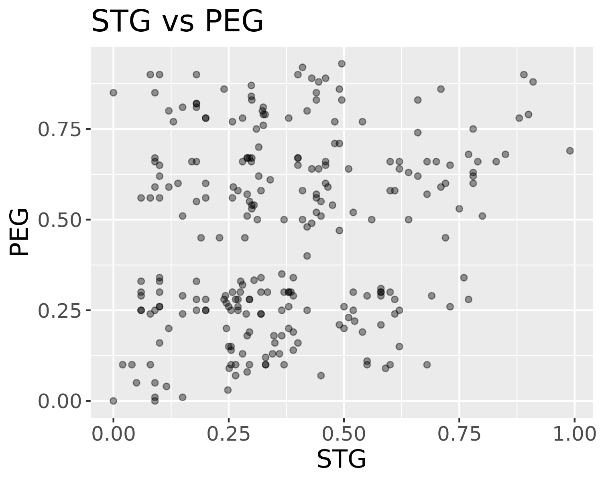
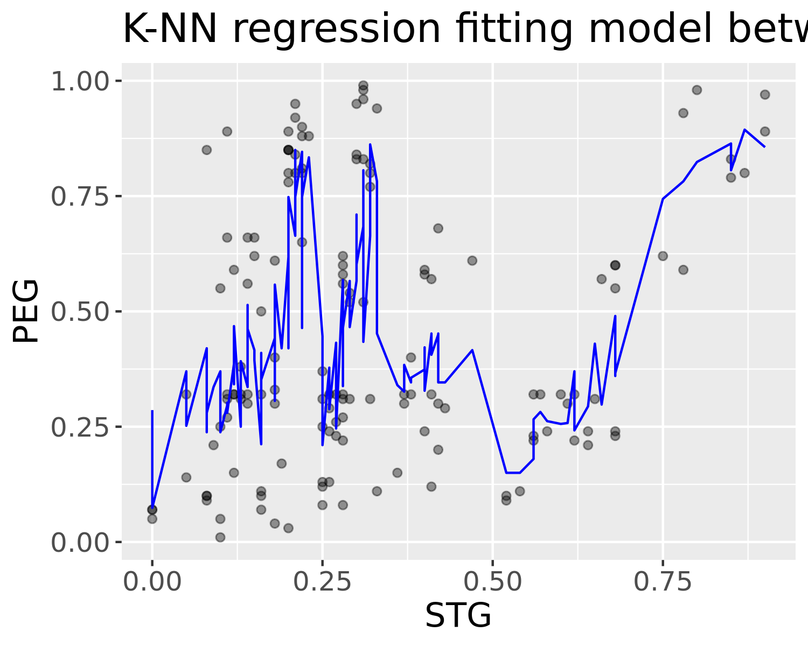

## Summary

In this project, we explore and predict the exam performance of students in the subject of Electrical DC Machines based on their study time by using linear regression (LN) and the K-nearest neighbors (K-NN) algorithm. Study time is chosen for this analysis as we identify it to be the variable with the highest correlation to exam performance. The results obtained in this analysis could help students gain insight into the necessary study times for specific scores as well as help instructors better understand the performance of students.

As a result of our analysis, we find that the Root mean square prediction error (RMSPE) for our LN model is 0.385, while the RMSPE of the K-NN model is 0.284. Although the K-NN model is slightly better than LN model, both types of regression have a prediction error percentage of about 40% (therefore our accuracy is about 60%). This can be attributed to the fact that exam performance could be affected by other external factors such as health condition, student IQ, stress levels, learning ability, learning environment and many others. It may also be indicative that the data set is not big enough to draw a relationship between just these two variables.

The dataset used is the @student-performance, User Knowledge Modeling Dataset provided by UCL Machine Learning Repository. And referenced from these sources: @user-modeling-approach, @knowledge-based-systems, @development-adaptive-edu-sys, @init-student-models, @results-supportive, @discussion-supportive. You could see citations in our reference section.

## Introduction

The research question of this analysis is: What will a student’s exam performance be based on their study time? 
For this analysis, we use the User Knowledge Modeling Data Set, which has a total of 5 variables observed about students, in addition to the classified knowledge level of user (UNS):

STG: the degree of study time for goal object materials
SCG: the degree of repetition number of user for goal object materials
STR: the degree of study time of user for related objects with goal object
LPR: the exam performance of user for related objects with goal object
PEG: the exam performance of user for goal objects
These variables were drawn from students’ learning-related activities on the web. The data was also already tidy and pre-divided into training and testing subsets.

The choice to analyse the relationship between PEG and STG is owed to a correlation analysis performed while preparing the data. In this step we ran a function to test the correlation of all numeric variables against PEG and determined that STG was most highly correlated to it. The correlation was also positive which is consistent with our intuition that increasing the degree of study time would result in higher/better exam performance. 

Thus, we pick STG as the predictor (explanatory variable) and PEG as the response variable. We first conduct a regression since our response variable is numerical. Since we are not sure which regression method (linear or K-NN) will be better at fitting our data set, we conduct both analyses and compare/contrast their prediction errors to determine the best model.

## Wrangle data

```{r setup, include=FALSE}
knitr::opts_chunk$set(echo=FALSE,
                      warning=FALSE,
                      message=FALSE)
library(tidyverse)
library(tidymodels)
library(docopt)
library(dplyr)
library(GGally)
library(reshape)
```

```{r prepare_data}
user_training <- read_csv("../data/processed/train_data.csv")
user_testing <- read_csv("../data/processed/test_data.csv")
```

## Summary Data

This section summarizes key characteristics and values of the explanatory variable (STG) and the response variable (PEG).

Table \@ref(tab:user-means-table) displays the means of the variables. 
```{r user-means-table}
user_means_table <- read_csv("../results/stats/means.csv") |> 
                    select(-1)
stg_mean <- user_means_table[1]
peg_mean <- user_means_table[2]

knitr::kable(user_means_table, caption = "Table of user means")
```


Table \@ref(tab:user-maxima-table) displays the maxima of the variables. 
```{r user-maxima-table}
user_maxima_table <- read_csv("../results/stats/maximum.csv") |> 
                    select(-1)
stg_max <- user_maxima_table[1]
peg_max <- user_maxima_table[2]
knitr::kable(user_maxima_table, caption = "Value of User maxima")
```

Table \@ref(tab:user-minima-table) displays the minima of the variables. 
```{r user-minima-table}
user_minima_table <- read_csv("../results/stats/minimum.csv") |> 
                    select(-1)
stg_min <- user_minima_table[1]
peg_min <- user_minima_table[2]
knitr::kable(user_minima_table, caption = "Value of User minima")
```


Tables \@ref(tab:user-means-table) - \@ref(tab:user-minima-table) show that the means are `r stg_mean` for STG and `r peg_mean` for PEG, the maximums are `r stg_max` for STG and `r peg_max` for PEG, and minimums are `r stg_min` for STG and `r peg_min` for PEG.

All of these three summaries show that the values of STG and PEG are close in value and have roughly the same scale. We will not need to scale or standardize the data for linear regression, but it is still good practice to scale the data for K-NN regression, since it is extremely sensitive to differing scales of the variables.

```{r user-observations-table}
user_observations_table <- read_csv("../results/stats/observations.csv")
knitr::kable(user_observations_table, caption = "Numbers of Observations")
```

Table \@ref(tab:user-observations-table) shows number of observations.

## Data Visualization 

```{r peg-stg-plot, out.width="50%", fig.cap = "Plot of PEG and STG"}

```

Figure \@ref(fig:peg-stg-plot) shows a scatterplot of PEG against STG. It shows that there isn’t a clear relationship or pattern between PEG and STG. There is neither a linear/nonlinear nor a positive/negative relationship, as the points are spread out widely on the graph.

Therefore, no evident relationship can be observed between these two variables.

## Methods

In order to answer our predictive question, we followed a series of steps to perform our data analysis.

We first dowloaded our dataset reproducibly (students’ exam performance about Electrical DC Machines) from the web. The data set was already initially split into training and data sets, so we loaded the respective sheets in. We could observe from the printed tables that the data was already tidy, since each row was a single observation, each column was a single variable, and each value was a single cell. Therefore, we did not need to do any further tidying.

Next, we prepared our dataset by accessing the dataset downloaded and reads the second and third sheets of the dataset. We then created a dunction to select only the numeric columns and create the training dataset using the selected data from sheet 2 and a user-inputted target variable. The function automaticallyidentified the variable with the highest correlation to the target variable. Thus, our training data includes only the column of the target variable and of the variable with the highest correlation to it (PEC and STg). We also created the testing data selecting only numeric columns from the third sheet and selecting only the relevant columns determined for training data.

We then performed relevant summaries of the data for exploratory data analysis. This included finding the means, maxima and minima, number of observations, and rows of missing data of our variables of interest (PEG and STG). This allowed us to get a better picture of the data we were working with. Following this, we created a visualization to see the relationship between our chosen variables, with STG on the x-axis and PEG on the y-axis. After plotting PEG against STG, we could not observe a strong relationship between the two, as we saw that the data points were spread out and did not follow a clear or direct relationship.

To perform the actual data analysis, we used regression to predict a student’s exam performance (PEG) based on their study time (STG). Since we were predicting a numerical value instead of a categorical value, we had to use regression to evaluate and create a prediction. From what we had seen from our exploratory data analysis, K-NN regression seemed to be the better choice as it would allow for more flexibility, but we tested both the accuracies of K-NN and linear regression, and compared them to find the best approach. We trained our regression with our training data and assessed its accuracy with our testing data. To assess the accuracy, we calculated the Root Mean Squared Prediction Error (RMSPE) of our model on the test data to see how well our model generalizes to future data. RMSPE is the square root of the difference between the observed and predicted value of the ith test observation, divided by the number of observations. This indicates how well our model is able to predict on unseen data.

To visualize our final results, we plotted our predictions as a line using geom_smooth overlaid our testing data to see the relationship between the two. The x-axis is STG, and the y-axis is PEG.

## Explore Data Analysis by two methods

## Linear Regression

```{r lm-regression-plot, out.width="50%", fig.cap = "Plot of Linear Regression"}

```
This figure \@ref(fig:lm-regression-plot) shows our linear regression model overlaid our testing data with STG on the x-axis and PEG on the y-axis.

We can see that since the data itself is quite spread out, the plotted line of our linear regression cuts through the points, as linear regression usually does. We can see that the points are distributed relatively evenly over and under our fitted line.
Table \@ref(tab:lm-rmse-table) shows the RMSE to assess goodness of fit on the training data.
```{r lm-rmse-table}
lm_rmse_table <- read_csv("../results/model/lm_rmse.csv")
lm_rmse <- as.numeric(round(lm_rmse_table[1],3))
knitr::kable(lm_rmse_table, caption = "LM RMSE table")
```

Table \@ref(tab:lm-rmspe-table) shows the RMSPE to assess how well the model predicts on the testing data.
```{r lm-rmspe-table}
lm_rmspe_table <- read_csv("../results/model/lm_rmspe.csv")
lm_rmspe <- as.numeric(round(lm_rmspe_table[1],3))
knitr::kable(lm_rmspe_table, caption = "LM RMSPE table")
```

Tables \@ref(tab:lm-rmse-table) and \@ref(tab:lm-rmspe-table) show that the RMSE (of our training data) of linear regression is `r lm_rmse` and the RMSPE (of our testing data) of the linear regression is  `r lm_rmspe`.

## K-NN Regression

```{r knn-regression-plot, out.width="50%", fig.cap = "Plot of K-NN Regression"}

```

This figure \@ref(fig:knn-regression-plot) shows a visualization of our K-NN regression. shows our K-NN regression model overlaid our testing data with STG on the x-axis and PEG on the y-axis.

We can see that although the data itself is quite spread out, the plotted line of our K-NN regression tries to follow the data points by producing “wiggles”. This indicates that it is more flexible than our linear model, since it tries to follow most of the points instead of cutting through them.

However, it is unclear if our model underfits or overfits the data since the testing data points themselves are spread out across the entire graph and there is a lot of randomness in our data.

```{r knn-rmse-table}
knn_rmse_table <- read_csv("../results/model/knn_rmse.csv")
knn_rmse <- as.numeric(round(knn_rmse_table[3],3))
knitr::kable(knn_rmse_table, caption = "KNN RMSE table")
```

Table \@ref(tab:knn-rmse-table) shows the RMSE (of training data) of K-NN regression.
```{r knn-rmspe-table}
knn_rmspe_table <- read_csv("../results/model/knn_rmspe.csv")
knn_rmspe <- as.numeric(round(knn_rmspe_table[3],3))
knitr::kable(knn_rmspe_table, caption = "KNN RMSPE table")
```

Table \@ref(tab:knn-rmspe-table) shows the RMSPE (of testing data) of K-NN regression.


Tables \@ref(tab:knn-rmse-table) and \@ref(tab:knn-rmspe-table) show that the RMSE (of training data) of K-NN regression is `r knn_rmse` and the RMSPE (of testing data) of K-NN regression is `r knn_rmspe`.

## Comparing Results

Looking at the visualizations of both methods, we cannot evidently see which model is better. The linear regression model has a relatively even ratio of points above and under the fitted line, but our K-NN Regression is also flexible and follows the data points. Hence, we must rely on the calculated RMSPE to determine the better model.

As seen in the results section, the the RMSE (of our training data) of linear regression is `r lm_rmse`, and the RMSPE (of our testing data) of the linear regression is `r lm_rmspe`. The RMSE (of training data) of K-NN regression is `r knn_rmse`, and the RMSPE (of testing data) of K-NN linear regression is `r knn_rmspe` By comparing the RMSE of both methods, we can see that our K-NN regression model has a slightly lower RMSE on our training data. By comparing the RMSPE of both methods, we can see that again our K-NN regression model has a slightly lower RMSPE on our testing data. Therefore, our K-NN Regression Model is slightly more accurate.

Due to the higher accuracy of our K-NN Regression, our final visualization of the best model is shown in Figure \@ref(fig:knn-regression-plot).

## Conclusion & Discussion 

Before performing the analysis, we expected to find a positive, linear relationship between PEG and STG. The intuition was that as a student spends more time studying, they should perform better. Our analysis however, found that the accuracy for our linear regression model is `r lm_rmspe`, while the accuracy of our K-NN regression is `r knn_rmspe` (where the range of degree is 1). Both of these types of regression have a prediction error percentage of about 40% (therefore our accuracy is about 60%). Our K-NN Regression model is slightly better than our linear regression due to its higher accuracy, which is consistent with the guess stated in the Methods section. The overall analysis shows that the model has relatively low accuracy.

This outcome of the analysis was unexpected. However, it is consistent with the Figure \@ref(fig:peg-stg-plot) , which shows no evidence of a relationship between these two variables. 

As mentioned in the Introduction, we had initially believed the accuracy of our K-NN regression to be about 80%. However, the tested accuracy was only of about 60%. Since there are no missing observations in our data set, there may be several reasons causing this difference in estimated accuracy and the actual accuracy calculated. On one hand, this can be attributed to the fact that exam performance could be affected by other external factors such as health condition, student IQ, stress levels, learning ability, etc. that were not in the data set. On the other hand, we can also say that our data set may not be big enough to directly draw a relationship between just study time and exam performance.Future studies could seek out other forms of prediction that can predict using multiple factors or find a larger data set with more observations.

In conclusion, one could draw the following conclusion from out findings while keeping in mind the analysis and dataset limitations: as study time increases, students generally perform better, but other external factors can also come into play and affect final results. 

Similar studies could build upon this one and attempt to identify study methods and efficiency parameter. Some future questions to consider are:

How much time should a student be spending studying to improve exam performance?
How do other factors (such as repetition, knowledge level, etc.) contribute to exam performance?
Can a similar approach be used in the industry to predict workers' performance based on their working time? How?

## References
